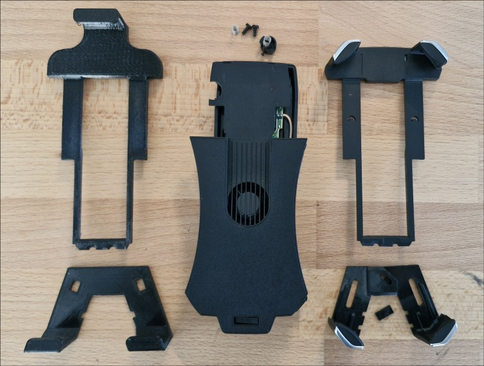
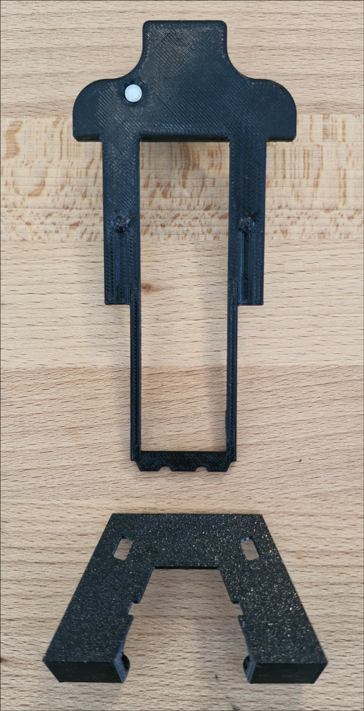
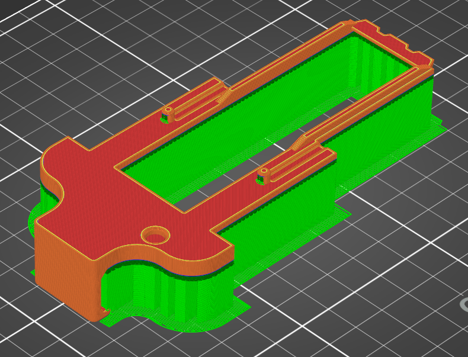
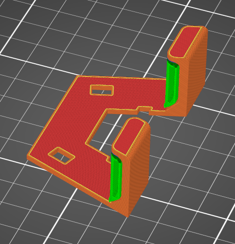
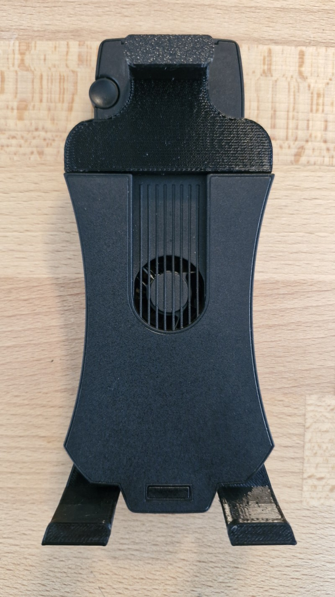
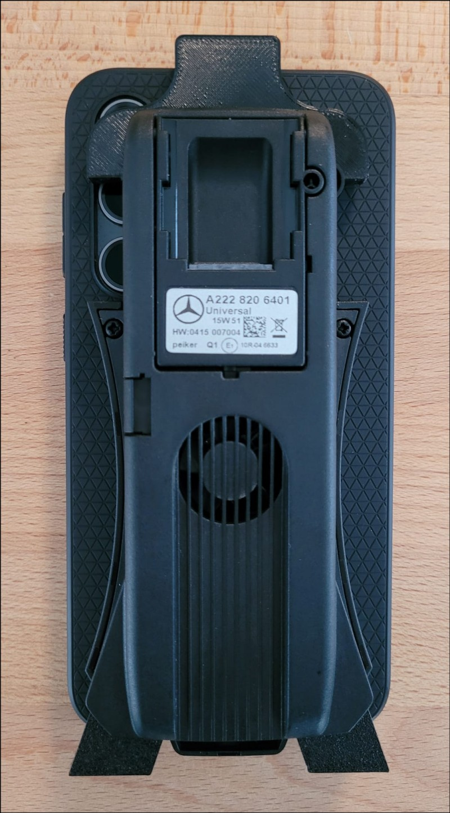

# "MB Universal Smartphone Holder" replacement parts for large mobiles
The "MB Universal Smartphone Holder" (Part Number A2228206401) isn't suitable for todays smartphone sizes. Here are two replacement parts which allows to clamp bigger size smartphones (up to 6.4", tested with a Galaxy S23FE including bumper case) and get again a better mobile connection.

STL files can be found in the subdirectory "STL-Data". The parts should be sliced with 100% infill and supports.
See the following examples to get the best results:

Pre-sliced BGCODE for PETG and Prusa3D MK4 printers can be found in the subdirectory "Prusa3D-Data".

Be aware that there is a little round magnet (5mm diameter, 1..2mm height) needed at the rear side of the top part. Glue the magnet with a drop of cyanoacrylate with the correct polarity (as in the original).

The phone holder fits very tightly with an S23FE inserted into the center console, it is not recommended to insert bigger phones than that.

The parts are modeled with [FreeCAD](https://www.freecadweb.org/).

Copyright (C) 2024 by Thorsten Godau (DL9SEC). All stuff here is licensed under [ Creative Commons Attribution-NonCommercial-ShareAlike 4.0 International](https://creativecommons.org/licenses/by-nc-sa/4.0).
